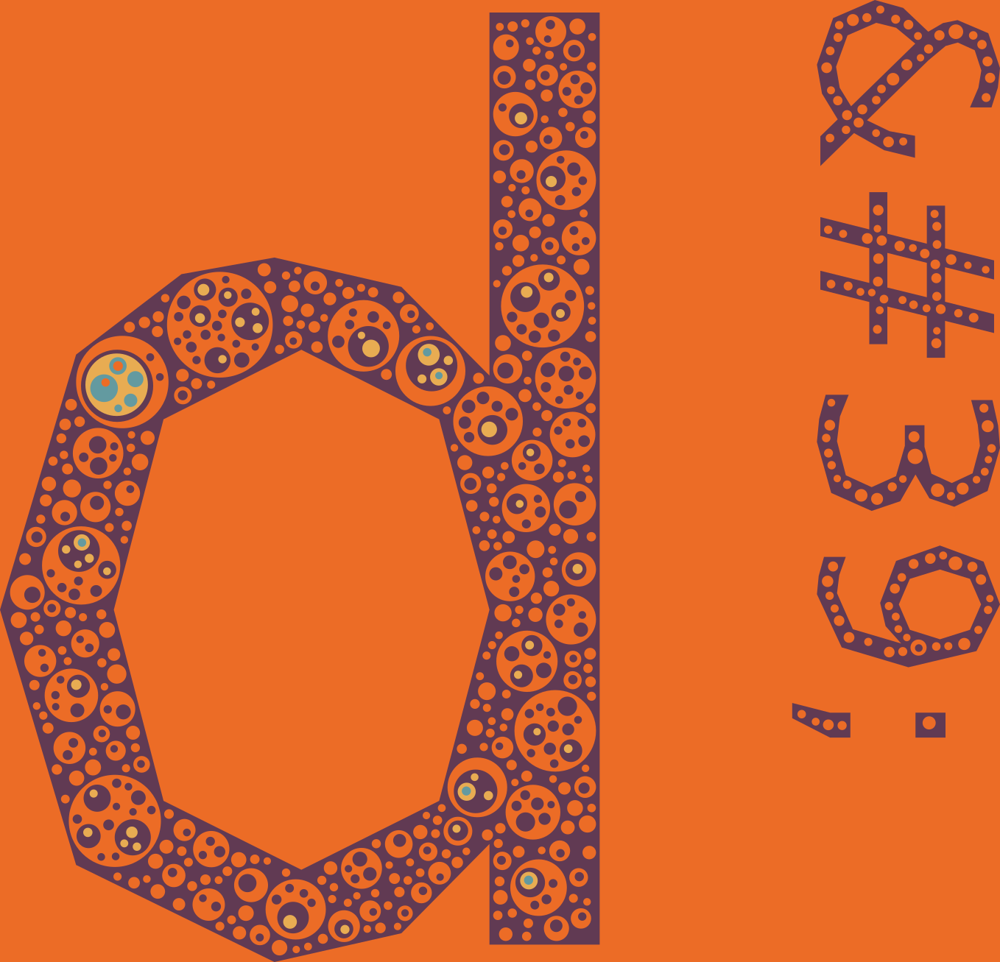
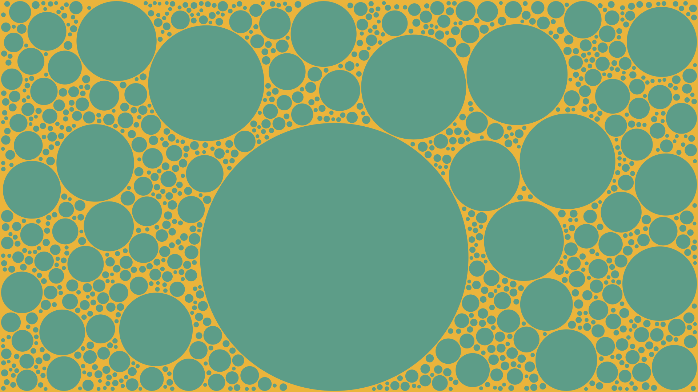
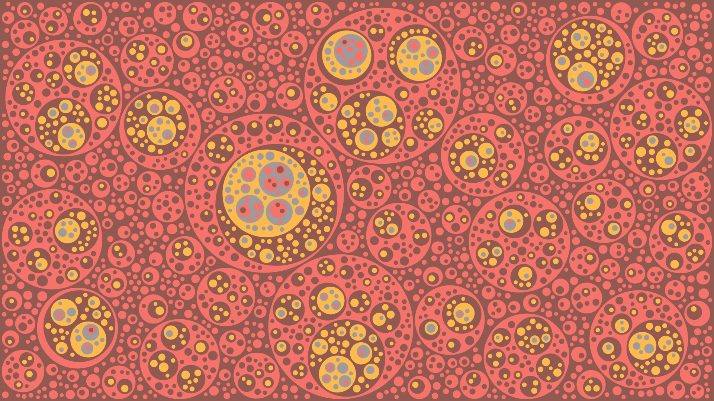

## circle-packing

Packs circles in a 2D shape using the power of SDFs!

A simple program is provided for experimenting with packing circles in a
rectangle with results that someone could define as "pleasing wallpapers".

Here are a couple of examples

```
$ cargo run --release -- --list-themes
$ cargo run --release -- --min-radius 20 --padding 5
$ cargo run --release -- --min-radius 5  --padding 3 --theme dt08 --no-inside
```

Also, take a look at the examples for additional functionality the library has,
but that's not exposed to the binary.




